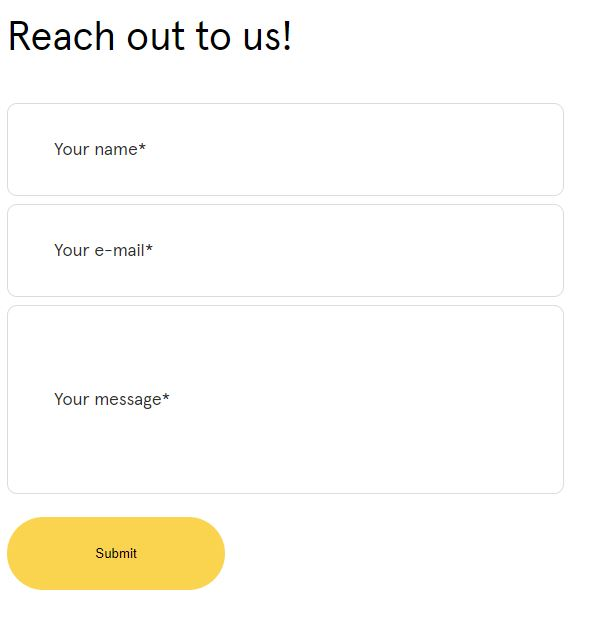
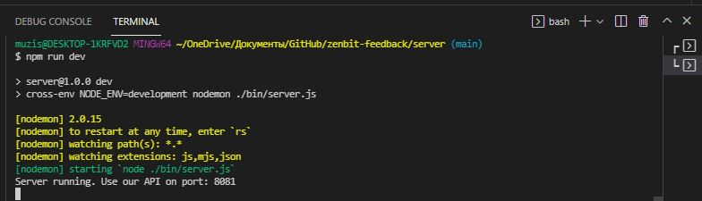
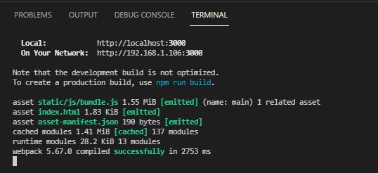

# "ZenbitTech" trainee full Stack Developer Test "Feedback Form"
 

### Front-End 
... was bootstrapped with [Create React App](https://github.com/facebook/create-react-app). 

The front-end was written in Rect.js with the use of auxiliary libraries:
"axios", "react-dom", "react-router-dom"
The use of "useState" made the task easier, for styling I used a modular connection with a style file.

### Back-End
... was bootstrapped with [Node.js](https://nodejs.org/) and files in this Repo. folder /[server](https://github.com/Mishka31/zenbit-feedback/tree/main/server)/...
The Back-End use of auxiliary libraries:
    "cors": "^2.8.5",
    "cross-env": "7.0.3",
    "dotenv": "^15.0.0",
    "express": "^4.17.2",
    "joi": "^17.6.0",
    "nodemon": "^2.0.15",
    "pg": "^8.7.1"

In my opinion, backend and frontend in one repository makes the work easier and faster. At the same time, I learned how to use PostgreSQL based on MySQL.

To start the server, first of all, you need to open the repository in the development environment and use the "npm run dev" command to start the development mode. The backend will start on the host "8081", the terminal will show as in the screenshot below. Next, we can work with the database
CRUD technology was used to write the database.

### Available Scripts in Front-End

### `npm start`
Runs the app in the development mode.\
Open [http://localhost:3000](http://localhost:3000) to view it in your browser.

### Launch application:

Open the project repository in the development environment application and enter the command "npm start" in the Terminal. After a successful launch, you will get the following output:

After that, you can use the application

